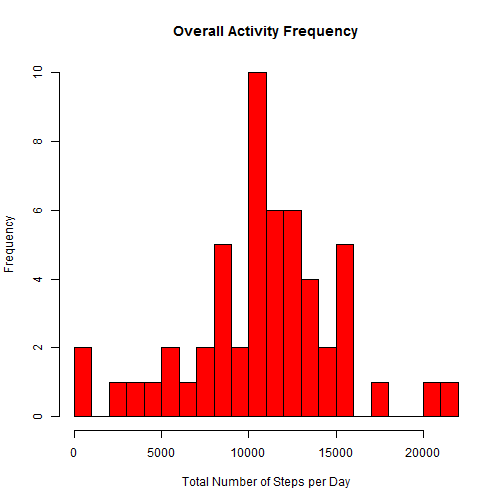
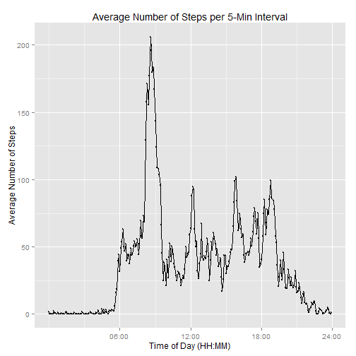
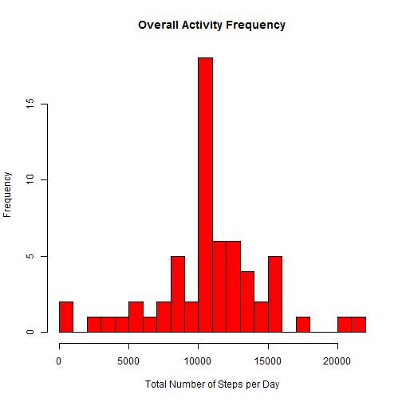
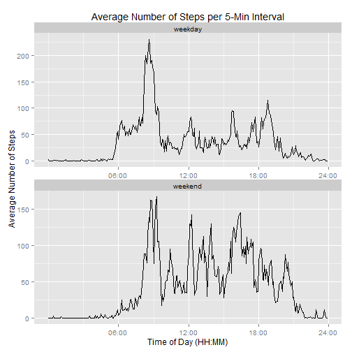

This is the Assignment 1 in the Coursera Reproducible Research Course.

## Loading and preprocessing the data

1. The data for this assignment was be downloaded from the course web site.


```r
# download the data
temp <- tempfile()
download.file("http://d396qusza40orc.cloudfront.net/repdata%2Fdata%2Factivity.zip",temp)
data <- read.csv(unz(temp, "activity.csv"))
unlink(temp)

# setting to English 
Sys.setlocale("LC_TIME", "English")
```

```
## [1] "English_United States.1252"
```

```r
# libraries needed
library(plyr)
library(ggplot2)
```

## What is mean total number of steps taken per day?

1. The total number of steps taken each day is calculated. First, the interval-variable will be transformed to a new variable in the HH:MM:SS format.


```r
# formatting the interval data to a new variable in the HH:MM:SS format
# this is not extremly efficient but avoids to include an incorrect date
today = Sys.Date()
data$int_date <- formatC(as.numeric(data$interval),width=4,
                         format='d',flag='0')
data$int_date<- strptime(data$int_date, format="%H%M", tz = "")
data$int_date <- gsub(data$int_date,pattern= today,
                      replacement="",fixed=T)

# ignoring the NAs
clean <-na.omit(data)

# summarizing the data for the total number of steps 
# (tot_steps) taken each day
sum_data <- ddply(clean, .(date), summarize, 
                  tot_steps = sum(steps, na.rm = TRUE))
```

2. A Histogram (Figure 1) is made of the total number of steps taken each day. 


```r
# histogram with the total number of steps taken each day
hist(sum_data$tot_steps, col = "red",
     xlab = "Total Number of Steps per Day",  
     main = "Overall Activity Frequency",
     breaks = 20)
```

 

3. The mean and median of the total number of steps taken per day are reported. 


```r
mean1raw <- mean(sum_data$tot_steps)
mean1 <- prettyNum(mean1raw)
med1 <- median(sum_data$tot_steps)
```

The mean of the total number of steps taken per day is: 10766.19. The median is 10765.

## What is the average daily activity pattern?

1. A time series plot of the 5-minute interval and the average number of steps taken, averaged across all days was created (Figure 2). 


```r
# average across each 5-minute interval 
sum_interval <- ddply(data, .(int_date), summarize, av_steps = mean(steps, na.rm = TRUE))

#adding an additional column counting the intervals as workaround for better labeling of x-axis
intervals <- c(1:288)
data_interval <- cbind(sum_interval,intervals)

#checking that this additional column does reflect the row number
nrow <- nrow(data_interval)
if (!(nrow == 288)) stop ("X-axis description is incorrect")
```


```r
# ploting the average number of steps taken per interval across all days
library(ggplot2)
ggplot(data=data_interval, aes(y=av_steps, x=intervals, group=1)) + 
  geom_line() + 
  geom_point(size=1, shape=21) +
  labs (y= "Average Number of Steps") +
  labs (x = "Time of Day (HH:MM)") +
  labs (title = "Average Number of Steps per 5-Min Interval")+
  scale_x_continuous(breaks=c(73, 145, 217, 289), 
                     labels = c("06:00", "12:00", "18:00", "24:00"))
```

 

2. Which interval contains the maximum?


```r
maximum <- which.max(data_interval$av_steps)
max_interval <- data_interval$int_date[maximum]
```

The interval at  08:35:00 contains the maximum. 

## Imputing missing values

1. The total number of missing values (NA) in the dataset are calculated and reported.


```r
missing_data <- sum(is.na(data$steps))
```

There are 2304 rows with NA-values for 'steps'. 

2. As strategy for filling in all of the missing values in the dataset, the mean of steps for that 5-minute interval is used as a replacement.
3. A new dataset (repl_dat) with the missing data filled in this way is created. 


```r
# using suggestion from stackoverflow
# http://stackoverflow.com/questions/9322773/
inv_mean <- function(x) replace(x, is.na(x), mean(x, na.rm = TRUE))
repl_dat <- ddply(data, ~ interval, transform, steps = inv_mean(steps))
repl_dat <- repl_dat[order(repl_dat$date, repl_dat$interval),]  
```

4. A histogram (Figure 3) of the total number of steps taken each day is made with the new dataset.


```r
# summarizing per day
sum_repl_dat <- ddply(repl_dat, .(date), summarize, tot_steps = sum(steps, na.rm = TRUE))
```


```r
hist(sum_repl_dat$tot_steps, col = "red",
     xlab = "Total Number of Steps per Day", 
     main = "Overall Activity Frequency",
     breaks = 20)
```

 

It is calculated, if these values differ from the estimates from the first part of the assignment. 


```r
mean2raw <- mean(sum_repl_dat$tot_steps, na.rm = TRUE)
mean2 <- prettyNum(mean2raw)
med2raw <- median(sum_repl_dat$tot_steps, na.rm = TRUE)
med2 <- prettyNum(med2raw)

diff_mean <- mean1raw - mean2raw
diff_med_raw <- med1 - med2raw
diff_med <- prettyNum(diff_med_raw, digits = 2)
```

The mean of the total number of steps per day after the NA replacement is: 10766.19. The median is now 10766.19.

The difference for the mean-values is 0; for the median-values it is -1.2 steps. Thus, there is only a small impact of imputig missing data on these estimates. 

## Are there differences in activity patterns between weekdays and weekends?

1. A new vector ('week') is created with the two levels 'weekday' (for Monday to Friday) and 'weekend' (for Saturdays and Sundays).


```r
# replacing the day with the weekday using the weekdays() function
repl_dat$day<- strptime(repl_dat$date, format="%Y-%m-%d")
repl_dat$day <- weekdays(repl_dat$day, abbreviate = TRUE)

# creating the new variable with the two factors
repl_dat$week <- ifelse(repl_dat$day == "Sat" | repl_dat$day == "Sun", "weekend", "weekday")

sum_int_repl <- ddply(repl_dat, .(int_date, week), summarize, av_steps = mean(steps, na.rm = TRUE))
sum_int_repl <- sum_int_repl[order(sum_int_repl$week, sum_int_repl$int_date, na.last=NA),]  
```

2. A panel plot (Figure 4) containing the average number of steps taken per 5-Minute interval for weekdays and weekend-days is created. 


```r
nrow <- nrow(sum_int_repl)
if (!(nrow == 576)) stop ("X-axis description is incorrect")

intervals2 <- c(1:288, 1:288)
data_int_repl <- cbind(sum_int_repl,intervals2)
```


```r
ggplot(data=data_int_repl, aes(y=av_steps, x=intervals2, group=1)) + 
  facet_wrap( ~ week, scales = "free", nrow = 2, ncol = 1) +
  geom_line() + 
  labs (y= "Average Number of Steps") +
  labs (x = "Time of Day (HH:MM)") +
  labs (title = "Average Number of Steps per 5-Min Interval")+
  scale_x_continuous(breaks=c(73, 145, 217, 289), labels = c("06:00", "12:00", "18:00", "24:00"))
```

 

The mean for the average number of steps appears to be higher during the weekend than the weekday. 

Resetting some options: 


```r
detach(package:plyr) 
Sys.setlocale("LC_TIME", "")
```

```
## [1] "German_Germany.1252"
```
